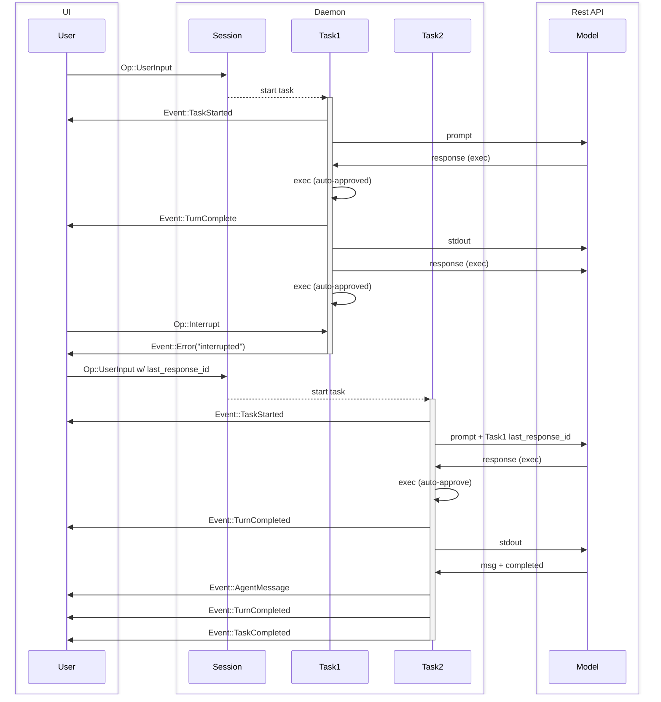

# Task Execution Flow Sequence Diagram

## Diagram Description

This sequence diagram illustrates the interaction flow between different components in the system:

### Components

- **User**: The end user interface
- **Session**: The daemon session manager
- **Task1/Task2**: Individual task executors
- **Model**: The REST API model/agent

### Flow Explanation

1. Initial task execution:
   - User sends input to session
   - Session starts Task1
   - Task1 interacts with Model and executes commands

2. Task interruption:
   - User interrupts Task1
   - Task1 returns error and terminates

3. New task with context:
   - User starts new task with reference to previous response
   - Session starts Task2
   - Task2 includes context from Task1
   - Task2 completes successfully

### Key Events

- `Op::UserInput`: User input operation
- `Event::TaskStarted`: Task initialization notification
- `Event::TurnComplete`: Single turn completion
- `Event::Error`: Error notification
- `Event::AgentMessage`: Model message event
- `Event::TaskCompleted`: Task completion notification

### Notes

- Auto-approval is used for command execution
- Tasks can reference previous responses using `last_response_id`
- Tasks can be interrupted by user operation